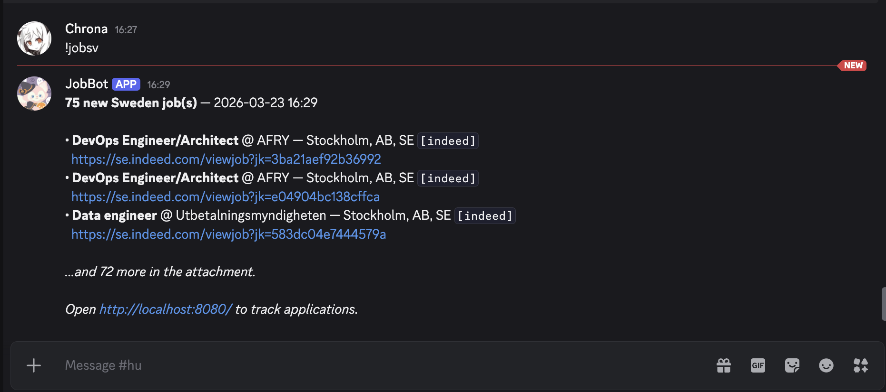
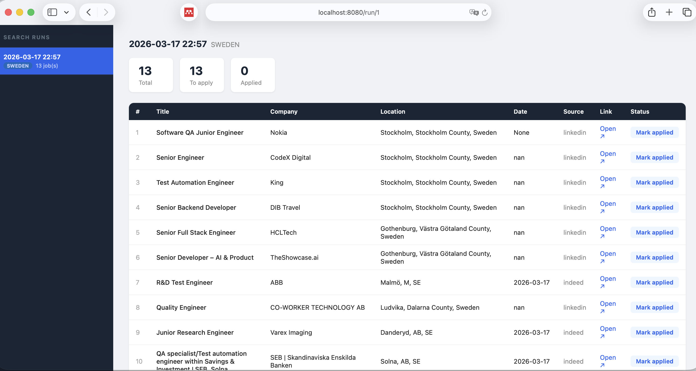
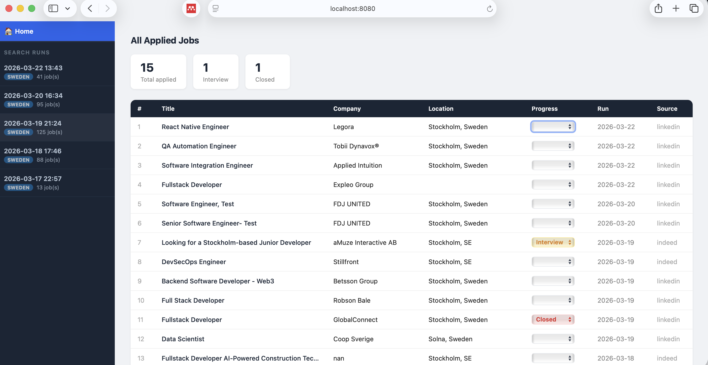

A Discord bot who searches enigneer(editable) related roles in 24 hours(editable) in Europe.

Collect all related opportunity from different sources(linkedin, indeed, academic roles) in a local webpage.

### Discord command sample


### Single run page - Collect all related roles order by city (Stockholm → Gothenburg → Malmö). Mark as applied.

### Home page - Collect all applied roles.


---

## Requirements

- Python 3.9+
- macOS (LaunchAgent setup) — Linux/Windows users can use the cron script or run manually
- A Discord account and server

---

## Setup

### 1. Clone and install

```bash
git clone https://github.com/yourusername/whowork.git
cd whowork
python -m venv venv && source venv/bin/activate
pip install -r requirements.txt
```

### 2. Create a Discord Bot

1. Go to [discord.com/developers/applications](https://discord.com/developers/applications) → **New Application**
2. **Bot** tab → **Reset Token** → copy the token
3. **Bot** tab → enable **Message Content Intent**
4. **OAuth2 → URL Generator** → scope: `bot`, permissions: `Send Messages`, `Attach Files`, `Read Message History`
5. Open the generated URL to invite the bot to your server

### 3. Create a Discord Webhook (for scheduled/cron runs)

1. In your Discord channel → **Edit Channel** → **Integrations** → **Webhooks**
2. **New Webhook** → **Copy Webhook URL**

### 4. Configure credentials

```bash
cp .env.example .env
```

Edit `.env`:

```env
DISCORD_TOKEN=your_bot_token_here
DISCORD_WEBHOOK_URL=your_webhook_url_here
```

### 5. Configure your job preferences

Edit [`config.py`](config.py):

- `JOBSPY_QUERIES` — search terms for LinkedIn/Indeed
- `ACADEMIC_QUERIES` — search terms for Euraxess/jobs.ac.uk
- `LOCATIONS` — cities and countries with priority order
- `TITLE_INCLUDE` / `TITLE_EXCLUDE` — keyword filters for job titles
- `HOURS_OLD` — look-back window (default 24h)
- `ACADEMIC_HOURS_OLD` — look-back for research roles (default 7 days)

### 6. Install background services (macOS)

```bash
bash setup_launchagent.sh install
```

This installs two LaunchAgents that start automatically on login:

- `bot.py` — Discord bot
- `web.py` — web UI at [http://localhost:8080](http://localhost:8080)

### 7. (Optional) Schedule a daily search

```bash
bash setup_cron.sh
```

Runs `run.py` every day at 8:00 AM and posts results to Discord via webhook.

---

## Usage

### Discord commands

| Command    | Description                                            |
| ---------- | ------------------------------------------------------ |
| `!jobsv`   | Search Sweden (Stockholm → Gothenburg → Malmö)         |
| `!jobeu`   | Search Europe excl. Sweden + academic RSS feeds        |
| `!status`  | Show how many jobs have been tracked so far            |
| `!reset`   | Clear seen-jobs history (resurfaces all jobs next run) |
| `!restart` | Restart the bot and web UI                             |
| `!help`    | Show all commands                                      |

### Web UI

Open [http://localhost:8080](http://localhost:8080) after running a search.

- Each run appears in the sidebar (date, region, count)
- Click a run to see its jobs in a table
- Click **Mark applied** on any row — persisted immediately to the local database
- Applied rows are dimmed so you can focus on what's left

### Managing services

```bash
bash setup_launchagent.sh restart   # restart bot + web UI
bash setup_launchagent.sh stop      # stop both
bash setup_launchagent.sh logs      # tail live logs
```

---

## Project structure

```
whowork/
├── bot.py                  Discord bot (commands + responses)
├── run.py                  Standalone script for cron/manual runs
├── web.py                  Flask web UI
├── search.py               Job search engine (JobSpy + RSS)
├── db.py                   SQLite persistence layer
├── export.py               Excel (.xlsx) export helper
├── config.py               All user-configurable settings
├── templates/
│   └── index.html          Web UI template
├── setup_launchagent.sh    macOS background service manager
├── setup_cron.sh           Daily cron job installer
├── requirements.txt
├── .env.example
└── LICENSE
```

---

## Data sources

| Source                                    | Type                | Roles                  |
| ----------------------------------------- | ------------------- | ---------------------- |
| LinkedIn                                  | Scraping via JobSpy | All commercial roles   |
| Indeed                                    | Scraping via JobSpy | All commercial roles   |
| [Euraxess](https://euraxess.ec.europa.eu) | RSS feed            | PhD, research, postdoc |
| [jobs.ac.uk](https://www.jobs.ac.uk)      | RSS feed            | Academic, research     |

> **Note:** JobSpy uses unofficial LinkedIn scraping. This is against LinkedIn's Terms of Service. Use responsibly and for personal use only. Excessive requests from a single IP may result in temporary blocks.

---

## Customisation tips

- To add a new country, append an entry to `LOCATIONS` in `config.py`
- To broaden or narrow results, edit `TITLE_INCLUDE` and `TITLE_EXCLUDE`
- To search more positions, add queries to `JOBSPY_QUERIES`
- The `ACADEMIC_HOURS_OLD = 168` (7 days) window for research roles prevents missing PhD postings that are updated weekly

---

## Features

- **Discord commands** — trigger searches directly from Discord, no terminal needed
- **Multi-source** — scrapes LinkedIn and Indeed via [JobSpy](https://github.com/Bunsly/JobSpy), plus Euraxess and jobs.ac.uk RSS feeds for academic/research roles
- **Smart filtering** — keyword-based title filtering to exclude senior roles and surface graduate/junior positions
- **Location priority** — results sorted by city priority (Stockholm → Gothenburg → Malmö → Copenhagen → Germany → rest of Europe)
- **Deduplication** — seen jobs are tracked so you never see the same posting twice
- **Web UI** — local dashboard to browse results by search run and mark applications
- **Runs in background** — macOS LaunchAgent keeps both the bot and web UI running automatically
